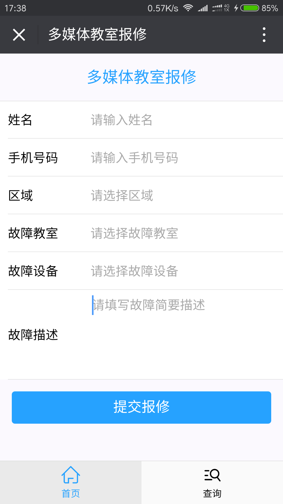
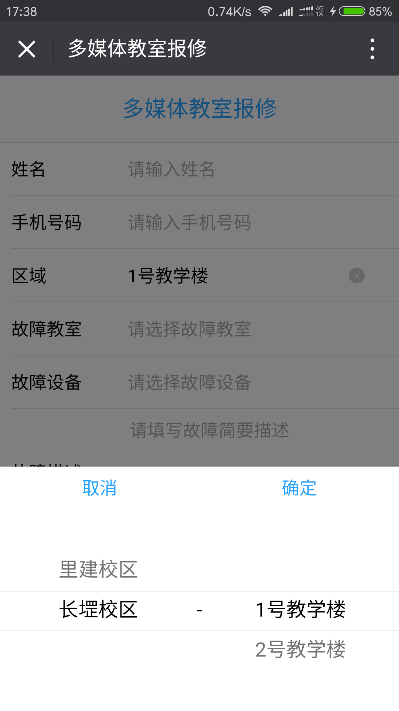
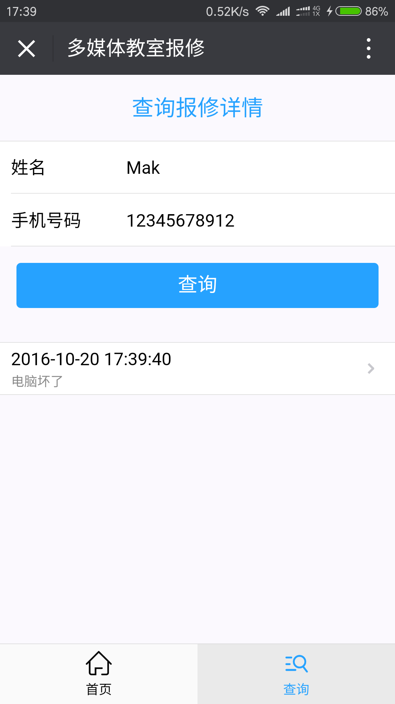
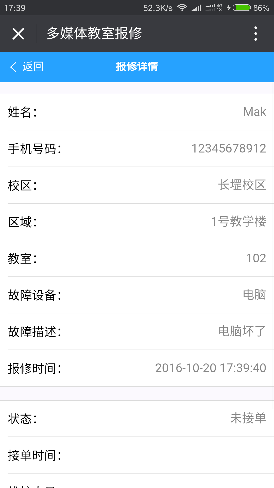
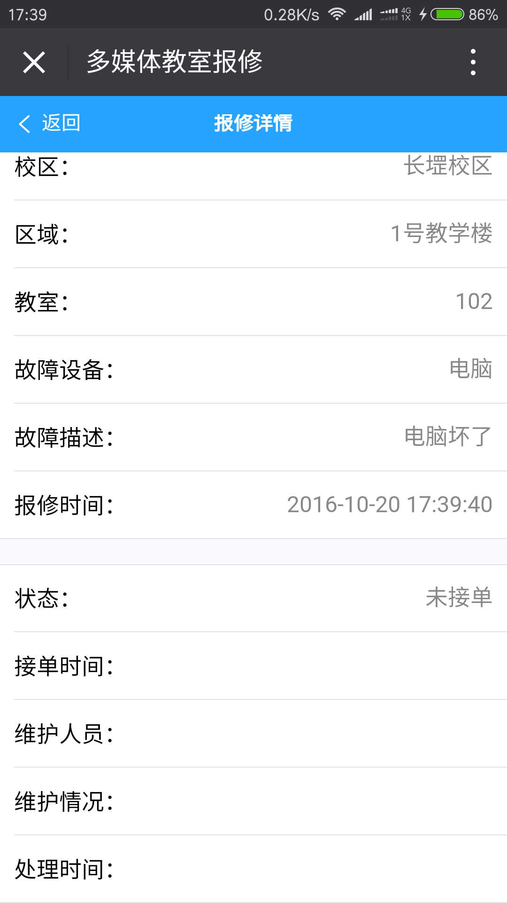
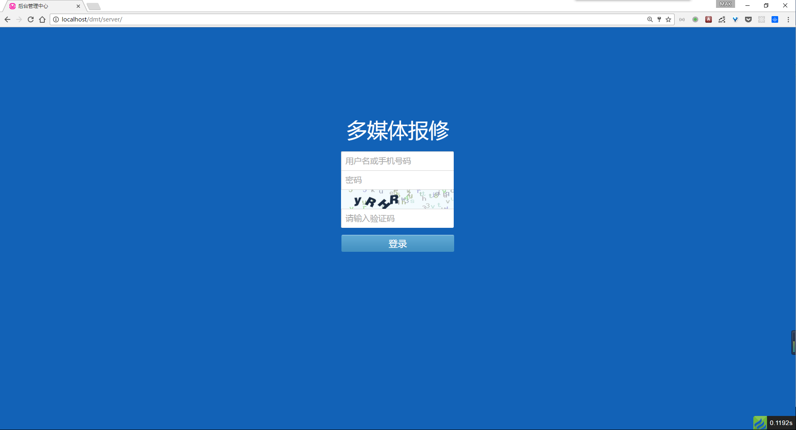
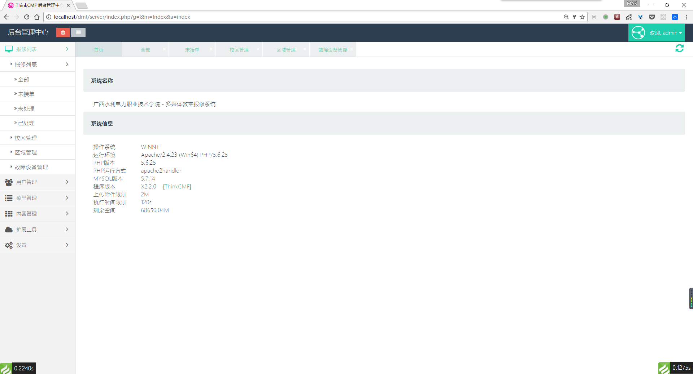

# 广西水利电力职业技术学院-多媒体教室报修平台

## 简介

此平台主要采用了 `vue2` + `thinkcmf` 开发的单页面应用

## 技术栈

### 前端
- vue2
- vue-router
- normalize.css
- webpack2
- SCSS

### 后端
- Thinkcmf x2.2.0

## 预览

### 前台界面

### 后台界面

